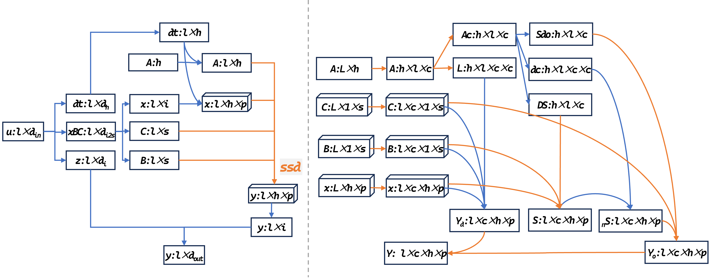

# Nd-Mamba2 for any dimension by pytorch
BiMamba2, implemented solely using PyTorch, provides N-dimensional support, including support for 1d, 2d, and 3d data. With BiMamba2, you can easily stitch it into any model to improve accuracy.

The following paper provides a detailed introduction to the NdBimamba2 module of the project：

> **Nd-BiMamba2: A Unified Bidirectional Architecture for Multi-Dimensional Data Processing**\
> Hao Liu*\
> Paper: [https://arxiv.org/abs/2312.00752](https://arxiv.org/abs/2411.15380)
 
[](https://doi.org/10.48550/arXiv.2411.15380)
[](https://doi.org/10.5281/zenodo.14185321) 

[中文README](README_中文.md)
 



## [nd_mamba2.py](torchnssd/nd_mamba2.py) Features (Updated on August 2, 2024)
-  ✅  Support customized 1D data (batch, channel, length)
-  ✅  Support customized 2D data (batch, channel,height,width)
-  ✅  Support customized 3D data (batch, channel,deep,height,width)
-  ✅  Support universal Nd data (batch, channel, * size)
-  ✅  There is good environmental support (pure PyTorch implementation, plug and play)
  
## [ex-bi-umamba2.py](torchnssd/nd_mamba2.py) New feature (updated on August 16, 2024)
-  ✅  Support export in torch.jit.scipt format (with the removal of the einops library and configuration classes)
-  ✅  Support onnx format export (using onnx_14 version, supporting operations on lower triangular arrays)
-  ✅  More readable (with a significant amount of redundant code removed)
-  ✅  Compatible with all features of nd_mamba2.py
  
## [ex_bi_mamba2_ac.py](torchnssd/ex_bi_mamba2_ac.py) New feature (updated on August 20, 2024)
-  ✅  Better 2D image semantic expression (using asymmetric convolution strategy to optimize 2D)
-  ✅  Compatible with all features in ex-bi-umamba2.py
-  ❌  Not supporting data formats such as 1d, 3d, and other dimensions

 
## [vssd_torch.py](torchnssd/vssd_torch.py) New Features (Updated on August 21, 2024)
-  ✅  Best 2D image semantic expression (optimized based on [VSSD]( https://github.com/YuHengsss/VSSD  ))
-  ✅  Friendly environment support (pure torch implementation, plug and play)
-  ❌  Cannot export to torch.jit.scipt or onnx formats
-  ❌  Not supporting data formats such as 1d, 3d, and other dimensions

## [ex-vssd.py](torchnssd/ex-vssd.py) New feature (updated on August 22, 2024) 
-  ✅  More readable (with code optimization for vssd_torch)
-  ✅  Support exporting to scientific and onnx formats
-  ✅  Compatible with all features in ex-vssd.py
-  ❌  Not supporting data formats such as 1d, 3d, and other dimensions
 
## [ex_vssd_cls_seg.py](torchnssd/ex_vssd_cls_seg.py) New feature (updated on August 28, 2024)
-  ✅  Support for segmentation tasks (added vssd backbone based shuffle segmentation decoder)
-  ✅  Support classification tasks (added vssd backbone based shuffle classification decoder)
-  ✅  Support exporting to scientific and onnx formats
-  ❌  Not supporting data formats such as 1d, 3d, and other dimensions

## Reminder
*If you want faster speed, you can replace Mamba2 in this project with Mamba2's official Cuda acceleration implementation and install various dependency packages according to official requirements. This will not affect the project's support for multi-dimensional data, but it will have an impact on the export of the model*

## Thanks
* [Albert Gu], [Tri Dao] [state-spaces/mamba]( https://github.com/state-spaces/mamba ) - authors of the Mamba-2 architecture
* [Yuheng Shi], [Minjing Dong] [YuHengsss/VSSD]( https://github.com/YuHengsss/VSSD ) - authors of the vssd architecture
* [Thomas] - author of [tommyip/mamba2-minimal]( https://github.com/tommyip/mamba2-minimal ),  who inspired this repo


## Citation

If nd-mamba2-torch is helpful for your research, please cite the following paper: 
```
@misc{liu2024ndbimamba2unifiedbidirectionalarchitecture,
      title={Nd-BiMamba2: A Unified Bidirectional Architecture for Multi-Dimensional Data Processing}, 
      author={Hao Liu},
      year={2024},
      eprint={2411.15380},
      archivePrefix={arXiv},
      primaryClass={cs.LG},
      url={https://arxiv.org/abs/2411.15380}, 
}
```
